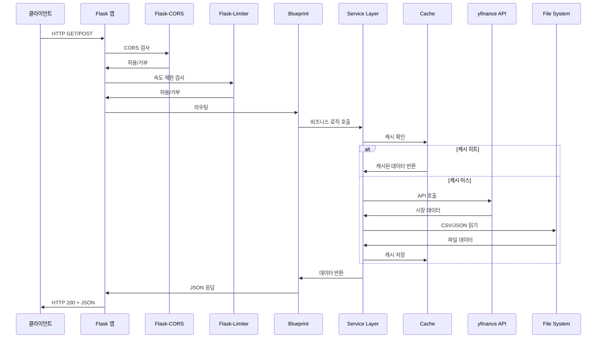
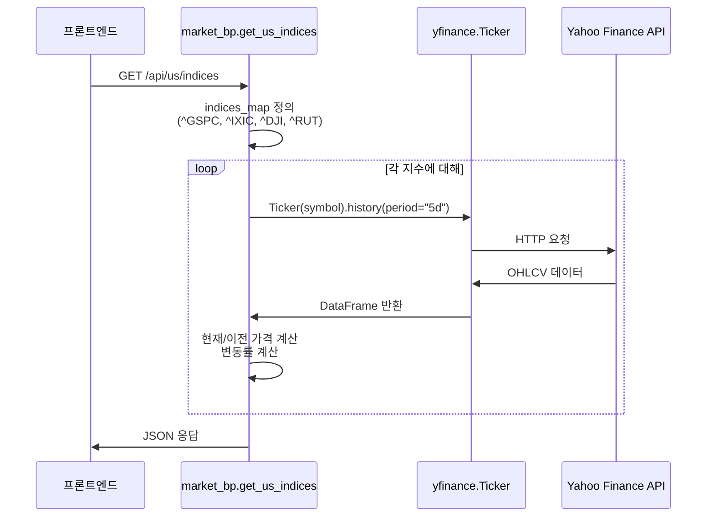
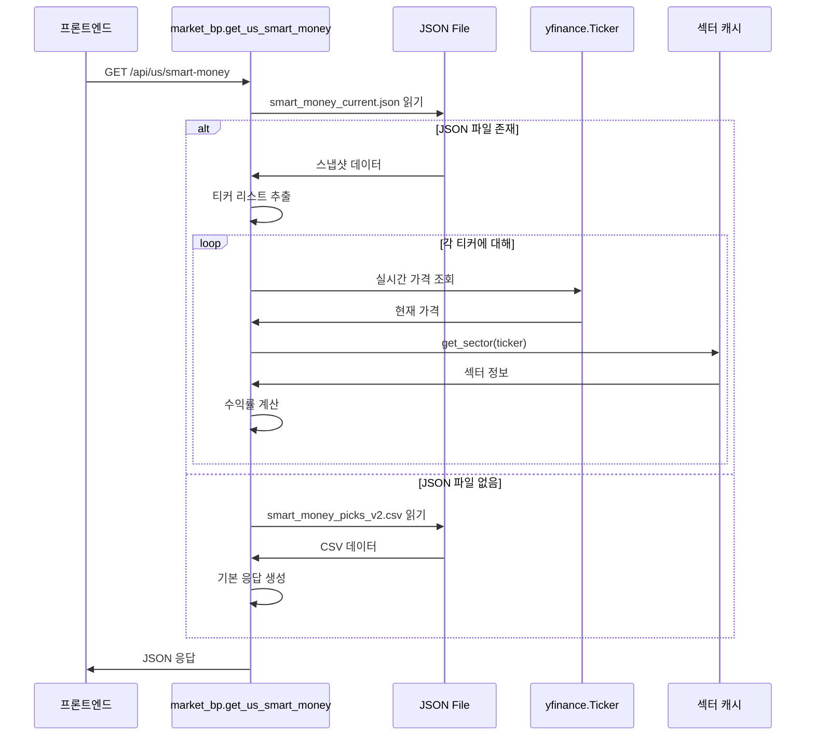
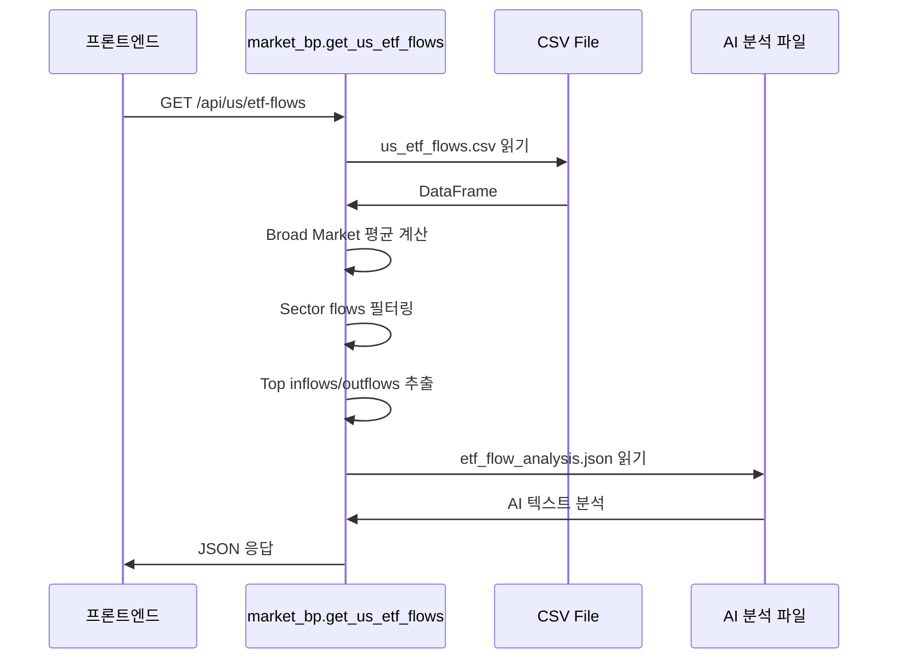
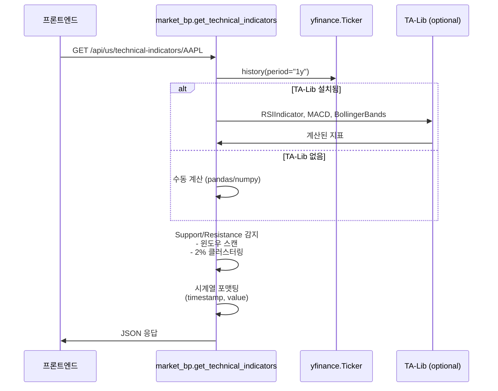
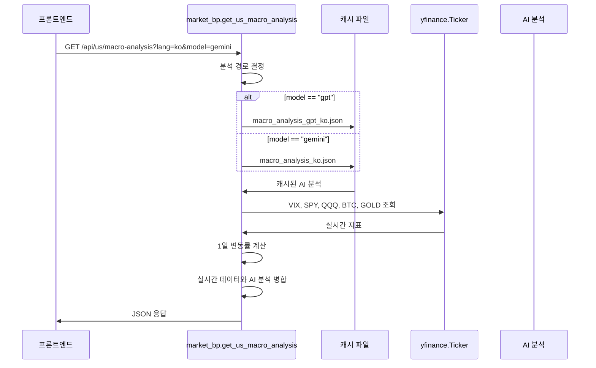
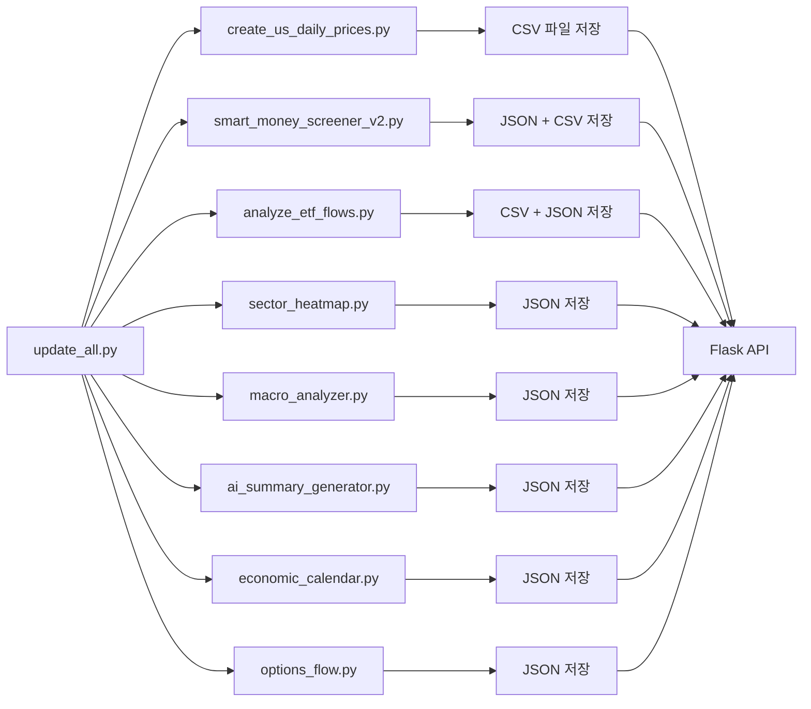

# 데이터 흐름

## 요청 처리 흐름

### Flask 요청 라이프사이클



### 계층별 데이터 처리

**1. Presentation Layer (app/routes/)**

- HTTP 요청 수신 및 파싱
- 쿼리 매개변수 검증
- 응답 포맷팅 (JSON)
- 에러 응답 생성

**2. Business Logic Layer (app/services/)**

- 데이터 조작 및 가공
- 캐싱 로직
- 외부 API 호출 래핑
- 비즈니스 규칙 적용

**3. Data Access Layer**

- yfinance API 호출
- 파일 시스템 I/O
- CSV/JSON 파싱

**4. External APIs Layer**

- Yahoo Finance API
- Google Gemini API
- OpenAI API

---

## 주요 데이터 흐름 경로

### 1. 실시간 지수 조회 (`/api/us/indices`)



**특징**:
- 캐싱 없음 (항상 실시간)
- 병렬 처리 가능하지만 순차 실행
- 실패 시 0값으로 fallback

---

### 2. 스마트 머니 픽 조회 (`/api/us/smart-money`)



**데이터 변환**:
1. JSON 스냅샷 로드 (price_at_analysis)
2. 실시간 가격 조회 (current_price)
3. 수익률 계산: `(current_price / price_at_analysis - 1) * 100`
4. 섹터 정보 추가

---

### 3. ETF 흐름 조회 (`/api/us/etf-flows`)



**데이터 처리**:
1. CSV 파일 로드 (pandas)
2. `category` 컬럼 확인 (안전한 접근)
3. Broad Market 평균 점수 계산
4. 상위 5개 inflows/outflows 추출
5. AI 분석 텍스트 추가

---

### 4. 기술적 지표 계산 (`/api/us/technical-indicators/<ticker>`)



**지표 계산 로직**:

**RSI (14-period)**:
```
delta = close.diff()
gain = (delta where > 0).rolling(14).mean()
loss = (-delta where < 0).rolling(14).mean()
rs = gain / loss
rsi = 100 - (100 / (1 + rs))
```

**MACD (12, 26, 9)**:
```
exp1 = close.ewm(12).mean()
exp2 = close.ewm(26).mean()
macd_line = exp1 - exp2
signal_line = macd_line.ewm(9).mean()
histogram = macd_line - signal_line
```

**Bollinger Bands (20, 2)**:
```
middle = close.rolling(20).mean()
std = close.rolling(20).std()
upper = middle + (std * 2)
lower = middle - (std * 2)
```

**Support/Resistance**:
1. 10-period 윈도우에서 로컬 최저/최고 탐지
2. 2% 클러스터링으로 유사 레벨 병합
3. 최근 5개 레벨 반환

---

### 5. 매크로 분석 조회 (`/api/us/macro-analysis`)



**데이터 병합 전략**:
1. 캐시된 AI 분석 로드 (정적 텍스트)
2. 실시간 지수 데이터 조회 (동적 가격)
3. 두 데이터 소스 병합

---

### 6. 섹터 매핑 흐름 (`get_sector`)

```mermaid
flowchart TD
    A[get_sector ticker 호출] --> B{SECTOR_MAP에<br/>있음?}
    B -->|있음| C[하드코딩된<br/>섹터 반환]
    B -->|없음| D{_sector_cache에<br/>있음?}
    D -->|있음| E[캐시된<br/>섹터 반환]
    D -->|없음| F[yfinance API 호출]
    F --> G[stock.info<br/>sector 추출]
    G --> H[섹터 약어<br/>매핑]
    H --> I[캐시 저장]
    I --> J[섹터 반환]
    F -->|에러| K[섹터 "-"<br/>반환]
```

**섹터 매핑 규칙**:
```
"Technology" / "Information Technology" → "Tech"
"Healthcare" / "Health Care" → "Health"
"Financials" / "Financial Services" → "Fin"
"Consumer Discretionary" / "Consumer Cyclical" → "Cons"
"Consumer Staples" / "Consumer Defensive" → "Staple"
"Energy" → "Energy"
"Industrials" → "Indust"
"Materials" / "Basic Materials" → "Mater"
"Utilities" → "Util"
"Real Estate" → "REIT"
"Communication Services" → "Comm"
```

---

## 캐시 사용 패턴

### 1. 서비스 계층 캐싱 (app/services/cache.py)

```python
@cached(ttl=300, key_prefix='ticker_data')
def get_ticker_data(ticker, period):
    # yfinance API 호출
    # 결과가 5분간 캐시됨
```

**캐시 키**: `ticker_data:{ticker}:{period}`

**만료 정책**: TTL (Time-To-Live) 300초

**캐시 저장소**: Python 인메모리 딕셔너리

### 2. 섹터 캐싱 (app/routes/market.py)

```python
_sector_cache = {}  # 전역 변수

def get_sector(ticker):
    if ticker in _sector_cache:
        return _sector_cache[ticker]
    # yfinance API 호출
    _sector_cache[ticker] = result
    _save_sector_cache(_sector_cache)  # 파일 저장
```

**캐시 키**: 티커 심볼

**캐시 저장소**:
- 메모리: 전역 딕셔너리
- 파일: `sector_cache.json`

**지속성**: 앱 재시작 후 파일에서 복원

### 3. 파일 기반 캐싱 (us_market/)

**AI 분석 결과**:
- `macro_analysis.json`
- `macro_analysis_en.json`
- `macro_analysis_gpt.json`
- `ai_summaries.json`

**스크리닝 결과**:
- `smart_money_current.json`
- `smart_money_picks_v2.csv`

**시장 데이터**:
- `us_etf_flows.csv`
- `sector_heatmap.json`
- `options_flow.json`
- `weekly_calendar.json`

---

## 외부 API 호출 패턴

### yfinance API

**호출 패턴**:
```python
import yfinance as yf

# 단일 티커
stock = yf.Ticker("AAPL")
hist = stock.history(period="1y")
info = stock.info

# 일괄 다운로드
data = yf.download(["AAPL", "MSFT", "GOOG"], period="5d")
```

**속도 제한**:
- 공식 문서에 없음
- 너무 빠른 요청은 차단될 수 있음
- 배치 다운로드 권장

### Google Gemini API

**호출 패턴**:
```python
import google.generativeai as genai

genai.configure(api_key=GEMINI_API_KEY)
model = genai.GenerativeModel('gemini-pro')
response = model.generate_content(prompt)
```

**속도 제한**:
- RPM (Requests Per Minute): 60
- TPM (Tokens Per Minute): 32,000

### OpenAI API

**호출 패턴**:
```python
from openai import OpenAI

client = OpenAI(api_key=OPENAI_API_KEY)
response = client.chat.completions.create(
    model="gpt-4",
    messages=[...]
)
```

**속도 제한**:
- RPM: 500 (GPT-4)
- TPM: 300,000 (GPT-4)

---

## 데이터 수집 파이프라인 (us_market/)

### 전체 데이터 흐름



### 개별 스크립트 데이터 흐름

#### smart_money_screener_v2.py

```
yfinance API (492 종목)
    ↓
[1] 수급 분석 (25%) - 거래량 데이터
[2] 기관 지지 (20%) - 13F holdings
[3] 기술적 지표 (20%) - RSI, MACD, BB
[4] 펀더멘털 (15%) - P/E, PEG
[5] 애널리스트 (10%) - ratings
[6] 상대 강도 (10%) - S&P 500 대비
    ↓
종합 점수 계산 (0-100)
    ↓
상위 20개 픽 선정
    ↓
저장: smart_money_current.json
      + smart_money_picks_v2.csv
```

#### macro_analyzer.py

```
yfinance API (VIX, 금리, 달러, 원화)
    ↓
경제 지표 수집
    ↓
Gemini API 프롬프트 전송
    ↓
AI 경제 분석 생성
    ↓
저장: macro_analysis.json (한국어)
      + macro_analysis_en.json (영어)
```

#### analyze_etf_flows.py

```
yfinance API (24개 ETF)
    ↓
1주일 수익률 계산
    ↓
자금 흐름 점수 산출
    ↓
시장 심리 분류 (Bullish/Bearish/Neutral)
    ↓
저장: us_etf_flows.csv
      + etf_flow_analysis.json
```

---

## 에러 처리 및 폴백

### yfinance API 폴백

```python
try:
    stock = yf.Ticker(ticker)
    hist = stock.history(period="5d")
    if hist.empty:
        return None
    # 정상 처리
except Exception as e:
    logger.error("yfinance API 오류", error=str(e))
    # 기본값 반환
    return {"price": 0, "change": 0}
```

### 파일 I/O 폴백

```python
# 1차 경로 시도
csv_path = "us_market/data/us_etf_flows.csv"
if not os.path.exists(csv_path):
    # 2차 경로 시도
    csv_path = "us_market/us_etf_flows.csv"
if not os.path.exists(csv_path):
    # 에러 응답
    return jsonify({"error": "ETF flows not found"}), 404
```

### AI API 폴백

```python
try:
    response = model.generate_content(prompt)
    return response.text
except Exception as e:
    logger.error("AI API 오류", error=str(e))
    return "AI 분석을 사용할 수 없습니다."
```

---

## 성능 최적화 전략

### 1. 배치 처리

**문제**: 개별 yfinance API 호출은 느림

**해결**: `yf.download()`로 일괄 다운로드

```python
# 비효율적 (개별 호출)
for ticker in tickers:
    data = yf.Ticker(ticker).history()

# 효율적 (일괄 다운로드)
data = yf.download(tickers, period="5d")
```

### 2. 캐싱

**문제**: 동일한 데이터 반복 조회

**해결**: TTL 기반 캐싱

```python
@cached(ttl=300, key_prefix='ticker_data')
def get_ticker_data(ticker):
    # 5분간 캐시
```

### 3. 파일 기반 저장

**문제**: AI API 호출은 비용이 큼

**해결**: 파일에 결과 캐싱

```python
# 이미 생성된 분석이 있으면 재사용
if os.path.exists("macro_analysis.json"):
    with open("macro_analysis.json") as f:
        return json.load(f)
```

### 4. 비동기 처리 (계획됨)

**문제**: 동기식 I/O는 병목이 됨

**해결**: async/await 도입 (현재 래퍼만 존재)

```python
async def get_multiple_tickers_async(tickers):
    # 동시 조회 (현재는 배치로 시뮬레이션)
```
