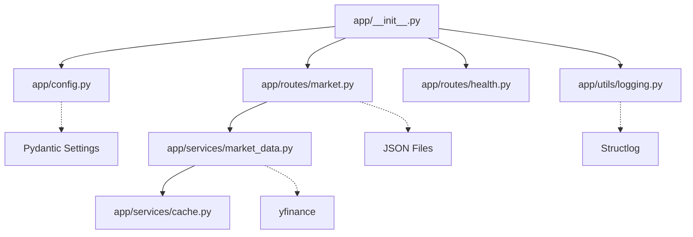
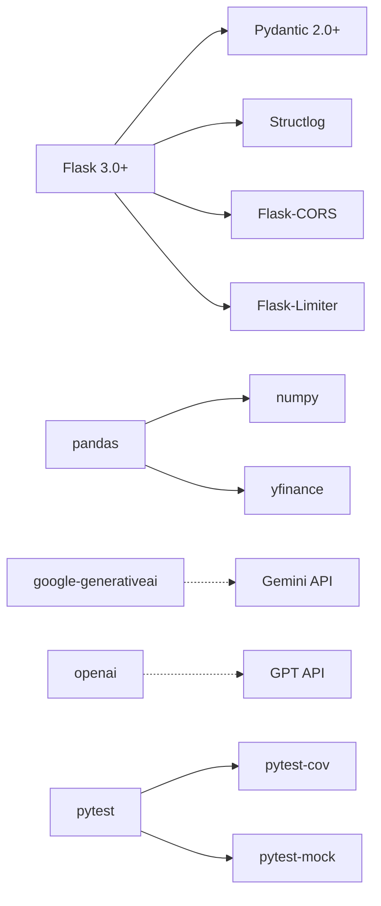
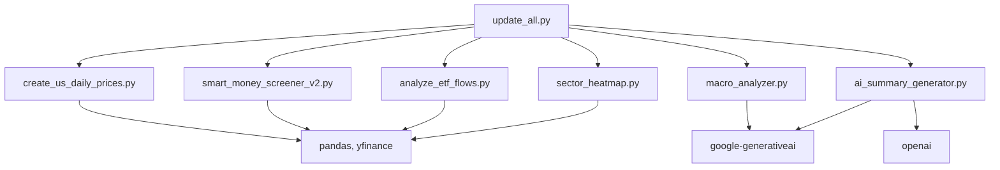

# 의존성 그래프

## 내부 모듈 의존성

### Flask 애플리케이션 (app/)



### 모듈 간 의존성 매트릭스

| 모듈 | 의존하는 모듈 | 팬인 (fan_in) | 팬아웃 (fan_out) |
|------|---------------|---------------|------------------|
| app/__init__.py | - | 0 | 4 |
| app/config.py | - | 2 | 0 |
| app/routes/market.py | app/utils/logging | 1 | 3 |
| app/routes/health.py | app/utils/logging | 1 | 0 |
| app/services/market_data.py | app/services/cache | 1 | 2 |
| app/services/cache.py | - | 1 | 0 |
| app/utils/logging.py | - | 2 | 0 |
| app/utils/decorators.py | - | 0 | 0 |
| app/utils/errors.py | - | 0 | 0 |
| app/utils/validators.py | - | 0 | 0 |

## 외부 의존성

### 핵심 의존성 (requirements.txt)



### 의존성 카테고리

#### 1. 웹 프레임워크
- **Flask 3.0+**: REST API 프레임워크
- **Flask-CORS 4.0+**: 크로스 오리진 리소스 공유
- **Flask-Limiter 3.5+**: 속도 제한

#### 2. 데이터 검증 및 설정
- **Pydantic 2.0+**: 데이터 검증과 설정 관리
- **pydantic-settings 2.0+**: Pydantic Settings 확장
- **python-dotenv 1.0+**: .env 파일 로드

#### 3. 데이터 처리
- **pandas 2.0+**: 데이터프레임 연산
- **numpy 1.24+**: 수치 계산
- **yfinance 0.2.28+**: 야후 파이낸스 API

#### 4. 로깅
- **structlog 24.0+**: 구조화된 로깅

#### 5. 시각화 (프론트엔드에서 사용)
- **seaborn 0.12.0+**: 통계 시각화
- **matplotlib 3.7.0+**: 플로팅

#### 6. AI/ML 통합
- **google-generativeai 0.3.0+**: Google Gemini API
- **openai 1.0+**: OpenAI API

#### 7. 프로덕션 서버
- **gunicorn 21.0+**: WSGI 서버

#### 8. 테스팅
- **pytest 8.0+**: 테스트 프레임워크
- **pytest-cov 4.0+**: 커버리지 리포트
- **pytest-mock 3.12+**: 모킹 지원

#### 9. 유틸리티
- **requests 2.31.0+**: HTTP 클라이언트
- **tqdm 4.66.0+**: 진행률 표시

## 의존성 트리 구조

### Flask 앱 의존성 트리

```
DashBoard Application
├── Flask 3.0+
│   ├── Werkzeug (Flask 내장)
│   └── Jinja2 (Flask 내장)
├── Pydantic 2.0+
│   ├── pydantic-core 2.0+
│   └── pydantic-settings 2.0+
│       └── python-dotenv 1.0+
├── Flask-CORS 4.0+
│   └── Flask 3.0+
├── Flask-Limiter 3.5+
│   ├── Flask 3.0+
│   ├── limits 2.0+
│   └── rich 13.0+
├── Structlog 24.0+
├── pandas 2.0+
│   ├── numpy 1.24+
│   └── python-dateutil 2.8+
└── yfinance 0.2.28+
    ├── pandas 2.0+
    ├── numpy 1.24+
    └── requests 2.31+
```

### AI/ML 의존성 트리

```
AI/ML Integration
├── google-generativeai 0.3.0+
│   ├── google-ai-generativelanguage
│   └── protobuf 4.0+
└── openai 1.0+
    ├── httpx 0.24+
    ├── pydantic 2.0+
    └── tqdm 4.66+
```

### 테스팅 의존성 트리

```
Testing Framework
└── pytest 8.0+
    ├── pluggy 1.0+
    └── pytest-cov 4.0+
        ├── pytest 8.0+
        └── coverage 7.0+
    └── pytest-mock 3.12+
        ├── pytest 8.0+
        └── unittest.mock (Python stdlib)
```

## 데이터 수집 스크립트 의존성

### us_market/ 스크립트 공통 의존성



### 개별 스크립트 의존성

| 스크립트 | 주요 의존성 | 목적 |
|----------|-------------|------|
| create_us_daily_prices.py | pandas, yfinance, tqdm | 일일 가격 데이터 수집 |
| smart_money_screener_v2.py | pandas, yfinance, ta | 6-요인 스크리닝 |
| analyze_etf_flows.py | pandas, yfinance | ETF 흐름 분석 |
| sector_heatmap.py | pandas, yfinance | 섹터 히트맵 |
| macro_analyzer.py | google-generativeai, yfinance | Gemini 매크로 분석 |
| macro_analyzer_gpt.py | openai, yfinance | GPT 매크로 분석 |
| ai_summary_generator.py | google-generativeai, yfinance | AI 종목 요약 |
| economic_calendar.py | requests | 경제 캘린더 |
| options_flow.py | yfinance | 옵션 플로우 |
| analyze_13f.py | pandas, requests | 13F holdings |
| analyze_volume.py | pandas, yfinance | 거래량 분석 |
| insider_tracker.py | pandas, requests | 인사이더 거래 |
| portfolio_risk.py | pandas, numpy | 포트폴리오 리스크 |
| final_report_generator.py | pandas | 최종 리포트 |

## 의존성 관리 전략

### 버전 고정 (requirements.txt)

모든 주요 의존성은 최소 버전으로 고정되어 있습니다:

```
pandas>=2.0.0
numpy>=1.24.0
yfinance>=0.2.28
flask>=3.0.0
pydantic>=2.0.0
```

### 선택적 의존성

일부 의존성은 선택적입니다:

- **TA-Lib**: 기술적 지표 계산 (핸들러에 fallback 존재)
- **database drivers**: 현재 사용하지 않음 (향후 확장 가능)

### 개발 의존성

개발 환경에서만 필요한 의존성:

- **pytest**: 테스트 프레임워크
- **pytest-cov**: 커버리지 리포트
- **pytest-mock**: 모킹 지원
- **ruff**: 린팅 및 포맷팅 (pyproject.toml)

## 순환 의존성 감지

### 현재 순환 의존성

없음. 프로젝트는 순환 의존성이 없는 건전한 구조를 유지합니다.

### 의존성 방향 규칙

1. **Routes → Services**: 라우트는 서비스를 호출할 수 있음
2. **Services → Utils**: 서비스는 유틸리티를 호출할 수 있음
3. **Config → All**: 설정은 모든 모듈에서 참조 가능
4. **금지된 역방향 의존성**:
   - Services는 Routes를 호출할 수 없음
   - Utils는 Services를 호출할 수 없음

## 의존성 업데이트 전략

### 보안 업데이트

주요 보안 패치는 즉시 적용:

- Flask, Pydantic, requests 등 보안 민감도 높은 패키지
- CVE 발생시 즉시 업데이트

### 기능 업데이트

주요 기능 업데이트는 신중하게:

- 주요 버전 업데이트 (Flask 3.x → 4.x)는 테스트 후 적용
- 사이드 이펙트 확인 필요

### 고정된 의존성

다음 의존성은 특정 버전에 의존합니다:

- **Pydantic 2.0+**: v1에서 v2로의 호환되지 않는 변경
- **Flask 3.0+**: 2.x에서 3.x로의 주요 변경 사항

## 의존성 최적화 기회

### 중복 제거

현재 다음 모듈에서 yfinance를 직접 호출:

- `app/routes/market.py`
- `app/services/market_data.py`
- `us_market/*.py`

**개선 제안**: 모든 yfinance 호출을 `services/market_data.py`로 통일

### 느슨한 결합

현재 결합도:

- **높은 결합**: 라우트에서 직접 파일 I/O (`market.py`)
- **낮은 결합**: 서비스 계층을 통한 데이터 접근 (`market_data.py`)

**개선 제안**: 파일 I/O도 서비스 계층으로 이동

### 의존성 주입

현재 설정 관리:

- **하드코딩된 의존성**: `Config()` 직접 호출
- **개선 가능**: 의존성 주입 패턴 도입으로 테스트 용이성 향상
