# DashBoard Architecture Documentation

**@SPEC:IMPROVE-001** - Modular architecture overview and design decisions

---

## Table of Contents

1. [Architecture Overview](#architecture-overview)
2. [Design Principles](#design-principles)
3. [Component Architecture](#component-architecture)
4. [Data Flow](#data-flow)
5. [Security Architecture](#security-architecture)
6. [Scaling Strategy](#scaling-strategy)

---

## Architecture Overview

### High-Level Architecture

The DashBoard application follows a **modular monolithic architecture** using Flask Blueprints for separation of concerns.

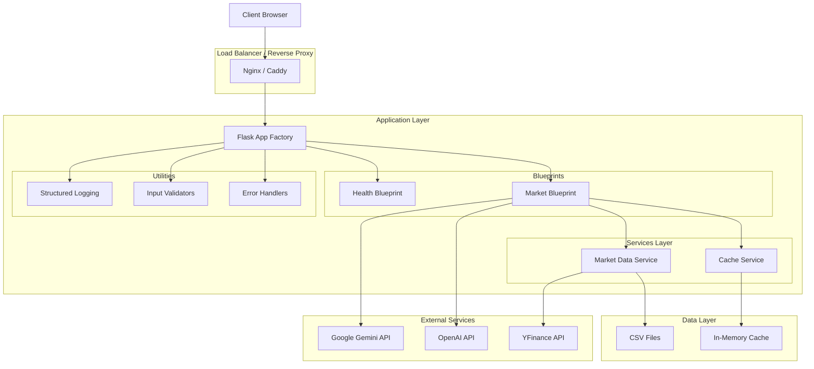

---

## Design Principles

### 1. Separation of Concerns

Each module has a single responsibility:

- **Routes (`app/routes/`)**: HTTP request handling
- **Services (`app/services/`)**: Business logic
- **Utils (`app/utils/`)**: Shared utilities
- **Models (`app/models/`)**: Data validation

### 2. Dependency Injection

Services are injected into routes, not instantiated directly:

```python
# Good: Service dependency
from app.services.market_data import market_data_service

# Routes use the service, not create it
@market_bp.route('/api/us/indices')
def get_indices():
    return market_data_service.get_index_data()
```

### 3. Configuration Management

Centralized configuration via Pydantic Settings:

```python
from app.config import Config

config = Config()
api_key = config.GOOGLE_API_KEY
```

### 4. Error Handling

Consistent error responses across all endpoints:

```python
{
  "success": false,
  "error": {
    "code": "ERROR_CODE",
    "message": "Human-readable message",
    "details": {}
  }
}
```

### 5. Logging Strategy

Structured JSON logging for better observability:

```json
{
  "timestamp": "2025-01-15T10:30:00Z",
  "level": "info",
  "event": "api_request",
  "endpoint": "/api/us/indices",
  "duration_ms": 45
}
```

---

## Component Architecture

### Application Factory Pattern

The application uses the factory pattern for flexibility:

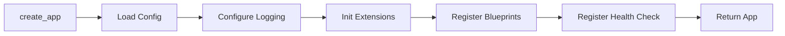

**Benefits:**
- Multiple app instances (testing, production)
- Easy configuration switching
- Extension initialization control

### Blueprint Structure

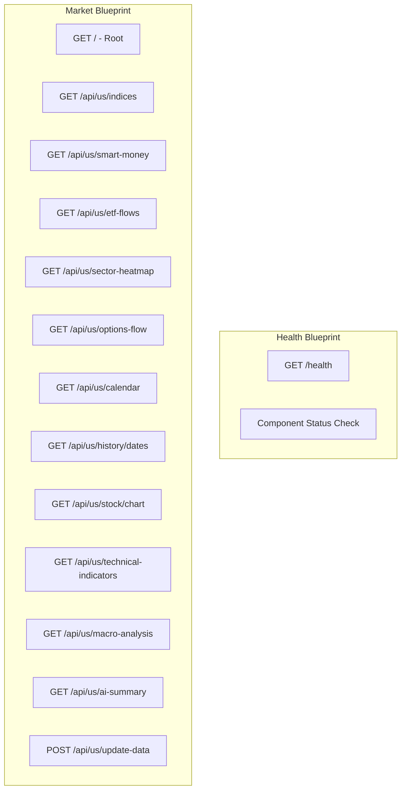

### Service Layer Architecture

```mermaid
graph TB
    subgraph "Cache Service"
        CS1[cache.get]
        CS2[cache.set]
        CS3[cache.delete]
        CS4[cache.clear]
        CS5[@cached decorator]
    end

    subgraph "Market Data Service"
        MDS1[get_ticker_data]
        MDS2[get_index_data]
        MDS3[get_sector_info]
        MDS4[get_etf_flows]
        MDS5[calculate_technical_indicators]
    end

    CS5 -.-> MDS1
    CS5 -.-> MDS2
    CS5 -.-> MDS3
```

**Cache Service Features:**
- In-memory storage with TTL
- Thread-safe operations
- Decorator-based caching
- Automatic cleanup

**Market Data Service Features:**
- CSV file parsing
- Technical indicator calculation
- Sector mapping
- Fallback mechanisms

### Utility Modules

```mermaid
graph TB
    subgraph "Logging Utility"
        LU1[configure_logging]
        LU2[get_logger]
        LU3[log_request]
        LU4[log_exception]
    end

    subgraph "Validators Utility"
        VU1[validate_ticker]
        VU2[validate_period]
        VU3[validate_chart_request]
        VU4[validate_ai_summary_request]
    end

    subgraph "Errors Utility"
        EU1[DashboardError]
        EU2[NotFoundError]
        EU3[ValidationError]
        EU4[RateLimitedError]
        EU5[APIError]
    end

    subgraph "Decorators Utility"
        DU1[@validate_ticker_param]
        DU2[@log_request]
    end
```

---

## Data Flow

### Request Flow

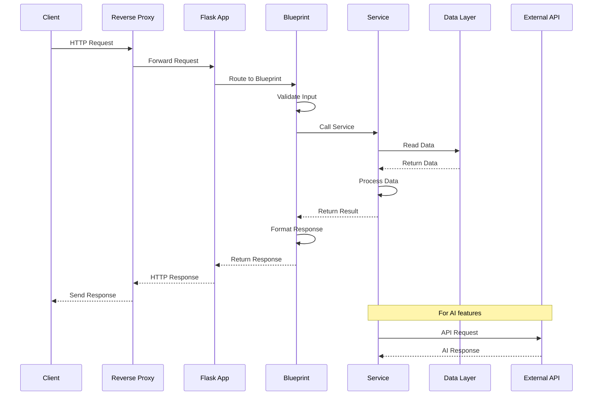

### Caching Flow

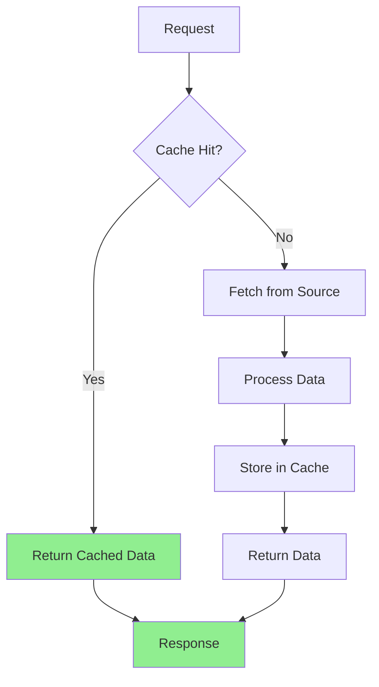

### Error Handling Flow

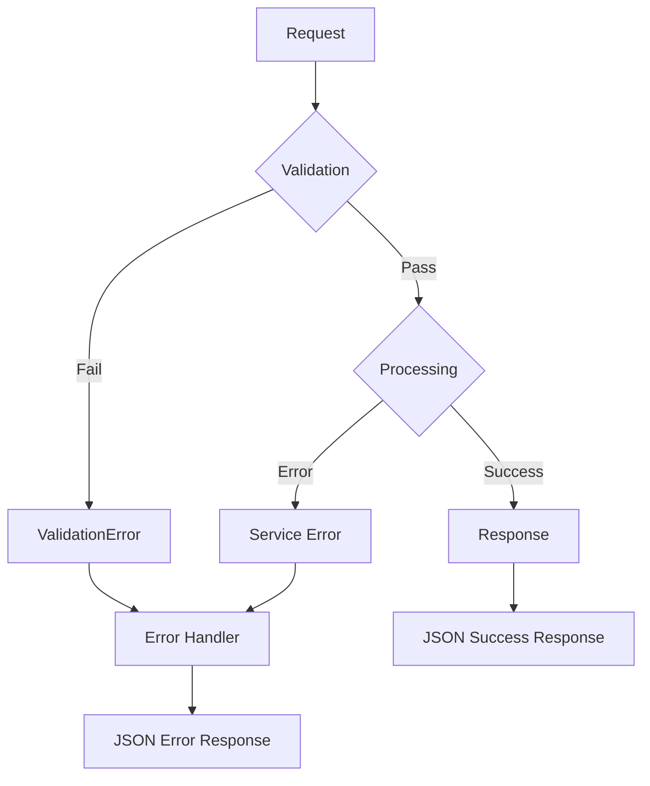

---

## Security Architecture

### Security Layers

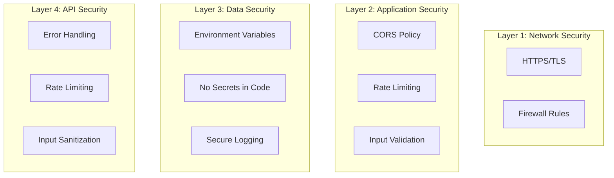

### Rate Limiting Strategy

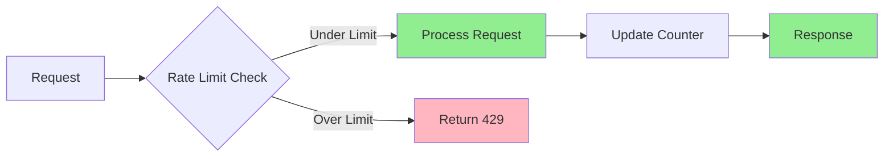

### CORS Configuration

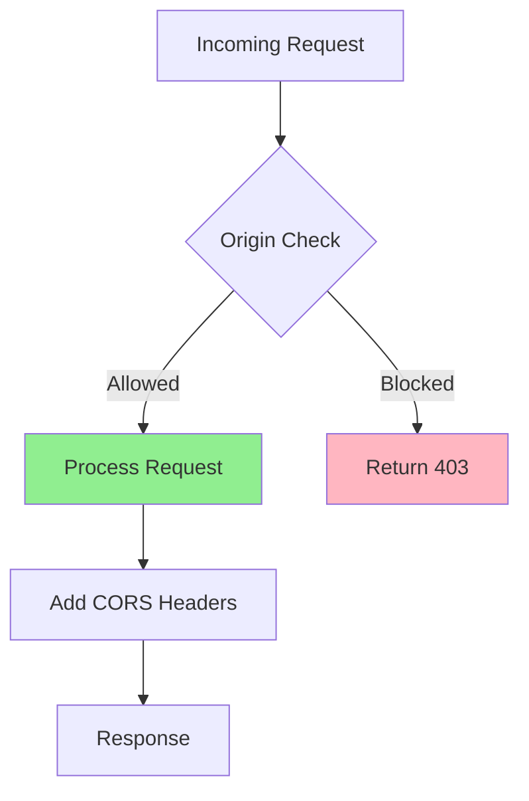

---

## Scaling Strategy

### Horizontal Scaling

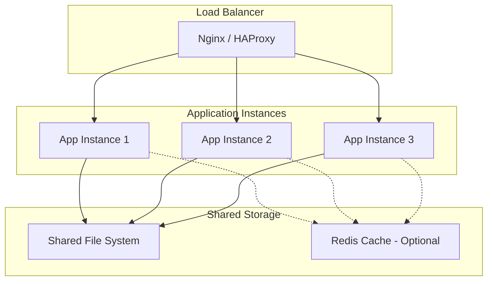

### Vertical Scaling

**Current Configuration:**
- Workers: 2
- Threads per worker: 4
- Total concurrent requests: 8

**Scaling Up:**
- Increase workers (CPU cores)
- Increase threads (I/O bound)
- Add more memory

### Caching Strategy

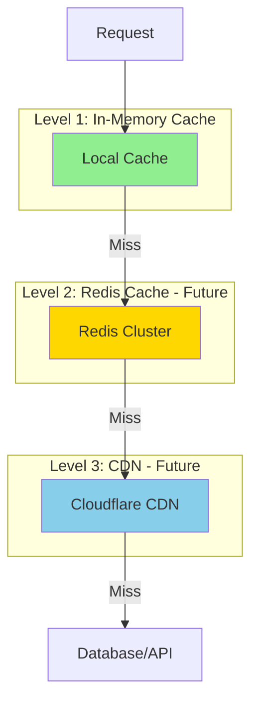

---

## Technology Stack

### Backend

| Component | Technology | Version |
|-----------|-----------|---------|
| Web Framework | Flask | 2.3+ |
| WSGI Server | Gunicorn | Latest |
| Data Validation | Pydantic | 2.x |
| Logging | Structlog | Latest |
| Data Processing | pandas | Latest |
| Numerical Computing | numpy | Latest |

### Security

| Component | Technology | Purpose |
|-----------|-----------|---------|
| CORS | Flask-CORS | Cross-origin requests |
| Rate Limiting | Flask-Limiter | DDoS protection |
| Validation | Pydantic | Input validation |

### Testing

| Component | Technology | Purpose |
|-----------|-----------|---------|
| Testing Framework | pytest | Unit/integration tests |
| Coverage | pytest-cov | Code coverage |
| Mocking | pytest-mock | Mock external services |

### Deployment

| Component | Technology | Purpose |
|-----------|-----------|---------|
| Containerization | Docker | Image building |
| Orchestration | Docker Compose | Local deployment |
| CI/CD | GitHub Actions | Automated testing |
| Hosting | Render/Vercel | Cloud deployment |

---

## File Structure

```
app/
├── __init__.py              # Application factory
├── config.py                # Pydantic Settings
├── models/
│   └── schemas.py           # Pydantic models
├── routes/
│   ├── __init__.py
│   ├── health.py            # Health check endpoints
│   └── market.py            # Market data endpoints
├── services/
│   ├── __init__.py
│   ├── cache.py             # Caching service
│   └── market_data.py       # Market data service
└── utils/
    ├── __init__.py
    ├── decorators.py        # Request decorators
    ├── errors.py            # Error handlers
    ├── logging.py           # Structured logging
    └── validators.py        # Input validation
```

---

## Design Decisions

### Why Flask Blueprint?

**Pros:**
- Modular route organization
- Easy to add new features
- Clear separation of concerns
- Testable components

**Cons:**
- More files than monolithic approach
- Slightly more complex setup

**Decision:** Blueprint architecture chosen for better maintainability and scalability.

### Why Pydantic Settings?

**Pros:**
- Type-safe configuration
- Environment variable validation
- Default values support
- IDE autocompletion

**Cons:**
- Additional dependency
- Learning curve

**Decision:** Pydantic provides robust configuration management with type safety.

### Why Structured Logging?

**Pros:**
- JSON format for parsing
- Better observability
- Easier debugging
- Tool integration

**Cons:**
- Less human-readable
- Requires log aggregators

**Decision:** Structured logging essential for production debugging and monitoring.

### Why In-Memory Cache?

**Pros:**
- Fast access
- Simple implementation
- No external dependencies

**Cons:**
- Not shared across instances
- Lost on restart
- Limited memory

**Decision:** Suitable for single-instance deployment. Can upgrade to Redis for scaling.

---

## Future Improvements

### Phase 2 Enhancements

1. **Redis Cache**: Shared cache across instances
2. **Database**: PostgreSQL for persistent storage
3. **Message Queue**: Celery for async tasks
4. **Monitoring**: Prometheus + Grafana
5. **Tracing**: OpenTelemetry integration

### Phase 3 Enhancements

1. **Microservices**: Split into separate services
2. **Event Sourcing**: Event-driven architecture
3. **CQRS**: Command Query Responsibility Segregation
4. **gRPC**: Internal service communication

---

## References

- [Flask Blueprint Documentation](https://flask.palletsprojects.com/en/2.3.x/blueprints/)
- [Pydantic Settings](https://docs.pydantic.dev/latest/concepts/pydantic_settings/)
- [Structlog](https://www.structlog.org/)
- [Gunicorn Documentation](https://docs.gunicorn.org/)

---

**@SPEC:IMPROVE-001** - Modular Architecture Refactoring
